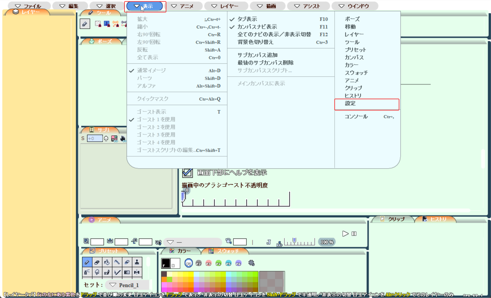
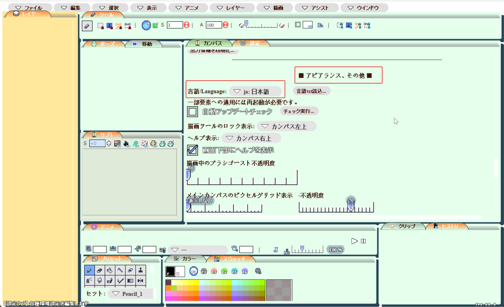
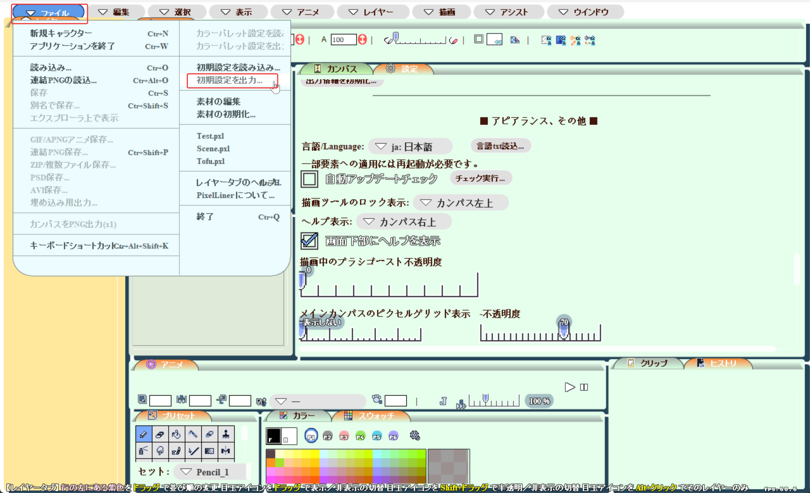

# PixelLinerTranslate

PixelLiner is a pixel-art software designed by くろば・Ｕ ( cloba.U ) [Twitter](https://x.com/cloba_____U). You can get detailed introduction about the software at [here](https://pixelliner.sakura.ne.jp/wiki/index.php?FrontPage).

**Currently, zh-CN & English translation is directly provided in Official releases older than 0.98! Visit [here](https://pixelliner.sakura.ne.jp/wiki/index.php?Download) to simply download it.**

Before 2026.5.22, original versions released on [official site](https://pixelliner.sakura.ne.jp/wiki/index.php?Download) only provides Japanese version. Therefore, this localization tool is created to help international creators.

This repository provides translated PixelLiner versions, and a simple translate tool without the need of source code.


## Install translated version
Currently, Chinese & English versions of PixelLiner 0.98.7/0.97.15/0.97.14/0.97.13 is provided. 
### Install translated release
Download releases at here:
| Version | Link | Supported languages | Backup Download
| --- | --- | --- | --- |
| 0.98.07~(Recommend!) | [Official Link](https://pixelliner.sakura.ne.jp/wiki/index.php?Download) | JA & EN & zh-CN | --- |
| 0.97.13 | [Release Link](https://github.com/DreamRuthenium/PixelLinerTranslate/releases/tag/0.97.13) | EN & zh-CN | [EN](https://aic.imtfe.org/archive/pixelliner-l10n/PixelLiner0.97.13_EN.zip) [zh-CN](https://aic.imtfe.org/archive/pixelliner-l10n/PixelLiner0.97.13_zh-CN.zip) |
| 0.97.14 | [Release Link](https://github.com/DreamRuthenium/PixelLinerTranslate/releases/tag/0.97.14) | EN & zh-CN | No backup yet |
| 0.97.15(Not recommended) | [Release Link](https://github.com/DreamRuthenium/PixelLinerTranslate/releases/tag/0.97.15) | zh-CN only | [zh-CN](https://aic.imtfe.org/archive/pixelliner-l10n/PixelLiner0.97.15_zh-CN.zip) |

**We strongly recommend using ver 0.98.x** This version has fixed multiple bugs, and zh-CN & English translation results has been integrated into official release.

#### Installing versions 0.98 or later:

Simply follow the instruction on official website, you can download & install the software.

After installation, you might find it hard to find language switch buttons if you can't read Japanese. You can follow this instruction:

First, click navigation bar at top in this sequence "表示→設定"

Then, try to find topic "■アピアランス、その他■" in the tab you just opened. The first option below it should be language setting.

Finally, to save the changes you just made to settings, click navigation bar "ファイル→初期設定を出力..."("File→Export Preferences..."). You don't need to actually save anything, just clicking the navigation bar will automatically save default settings.

#### Installing versions before 0.97:

Inside each pack, there's a .swf file and a .air file. They corresponds two different install methods. You can choose any of them, the installation result is same. Both method requires installing Adobe Air before. You can download it from [here](https://airsdk.harman.com/runtime).

#### Method 1(When you have PixelLiner already installed)
Replace pxl.swf in installation path.

#### Method 2(When you do not have PixelLiner installed): 
Simply click the .air file and install it. 

Notice: Since I don't have the original certificate, replace versions that have been installed from official website would throw a "Certificate don't match" error. In that case, you need to uninstall original version, then try installation again.


## Make my own translation
This is an old approach for versions before and include 0.97. If you want to translate versions older than 0.98, follow instructions [here](https://pixelliner.sakura.ne.jp/wiki/index.php?ApplicationLocal/Localization).
### STEP0 Setup
#### Crack tool setup
Download **release version** of [RABCDAsm](https://github.com/CyberShadow/RABCDAsm) and unzip it into `./RABCDAsm` (The executable file should be directly accessible in `./RABCDAsm`, please avoid structures like `./RABCDAsm/RABCDAsm`).

```shell
curl.exe -L "https://github.com/CyberShadow/RABCDAsm/releases/download/1.18/RABCDAsm_v1.18.7z" -o "RABCDAsm.7z"
```
```shell
tar -xf "RABCDAsm.7z" -C "./RABCDAsm"
```

#### Python setup
Python version: 3.14.0. There's no special packages that requires to be installed.

#### Apache Ant setup(optional)
Apache Ant allows you to repackage translated .swf files into air installation package. However, simply replace .swf file in installation path is also a feasible approach.

Firstly, you need an JDK with version higher than JDK8(17 is recommended) installed. Then, you should add java home into path, so it can be found by Apache Ant.

Secondly, download AIR SDK from [here](https://airsdk.harman.com/download), and install it.

Simple check if ant works:
```shell
ant -version
```

You should get message like:
```shell
Apache Ant(TM) version 1.10.1 compiled on February 2 2017
```

#### PixelLiner Download
Download the version of PixelLiner that you want to translate from [here](https://pixelliner.sakura.ne.jp/wiki/index.php?Download). Then, move the .air file into `./air` folder.

Good! you are ready to go!

### STEP1 Extract machine code from air file
```shell
python step1_hackAir.py
```
This script will extract swf file from .air file, then use RABCDAsm to create a `./air/pxl-0` directory, which will contain pxl-0.main.asasm (the main program file) and files for ActionScript scripts, classes, and orphan and script-level methods.

### STEP2 Extract texts to be translated
```shell
python step2_extractText.py name_you_set
```

This script will read all files extracted from step 1. Then, it will use this regex to match quotes whose contents contain at least one Japanese character.
```re
[^"\n]*[\u3040-\u30FF\u4E00-\u9FFF][^"\n]*
```
Then, it will make a map relationship by assigning unique index for each content. 

The origin map file will be stored into `./air/doNotModify/translateFrom.txt`, which will be used in step 3. You should not modify this file, unless you know what you are doing.

The file for translators will be stored into `./name_you_set.txt`, the name of txt file is depending on filename argument.

### STEP2.5 Translate
Open `./name_you_set.txt`, there's is going to be an English guide for translate procedure. Follow it and translate it into the language you want. You can safely overwrite it as long as you don't change index at start and quotes.

I have provided a sample file of Chinese translation in `./Ch_sample.txt`

### STEP3 Write back text
```shell
python step3_writeBackText.py name_you_set
```
This script will copy extracted files into `./translated/pxl-0/`. Then, it will replace all original Japan texts found in step2 into the translated version you just created.

### STEP4 Repackage
```shell
python step4_restoreAir.py
```
This script will re-package the translate codes into a swf file, which can be easily used. You can find it in `./translated/pxl.swf`

### STEP5 Package to ant(Optional)
I have prepared essential files for packaging ant files, but you can modify them if necessary.

You have to install Apache Ant to do this.
```shell
cd ./translated
ant
```

This command will generated a air package named PixelLiner_Modified, which can be directly installed.

## Known bugs
My operate system is Windows 11 with Chinese language pack, but I will test all bugs also on a Windows 11 JP system with different hardwares, and an IOS system.

### 0.97.15 all platforms - Freeze bug
File(ファイル) -> Edit Material(素材の編集) will cause the entire program to freeze, and unable to save/load/close.

This bug appears on all tested operate systems, also, both on original / translated PixelLiner. So I think this is not a bug caused by translation.

This bug do not appear on version 0.97.13, so If you need to edit material, it is recommend to use ver 0.97.13.

### 0.97.15 & 0.97.13 all platforms - Windows Ink bug
With wacom drive and Windows Ink enabled, drawing results in first 0.5s after the pen contact the board will lost. This bug can be avoided by disabling Windows Ink in wacom drive. This is also a original bug, not related to translation.

## Acknowledgments
Special thanks for [泡花茶的一只猹](https://github.com/CharaDrinkTea255), who provided important reverse engineering knowledge and download server.